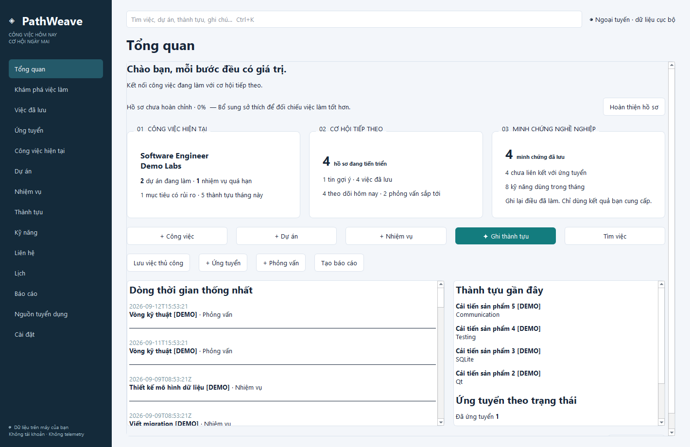
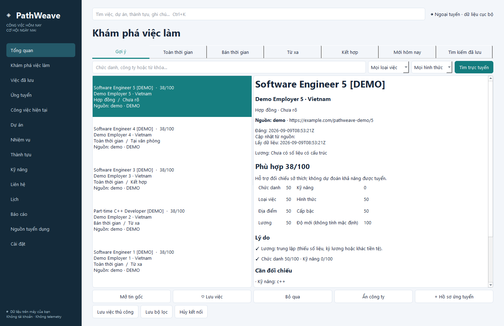
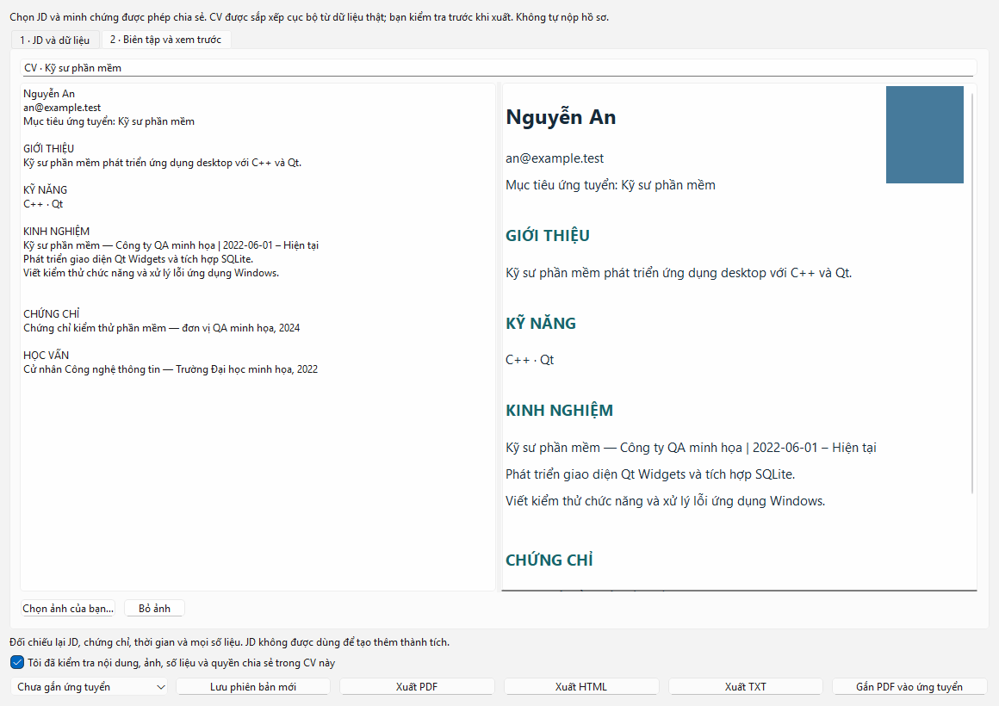
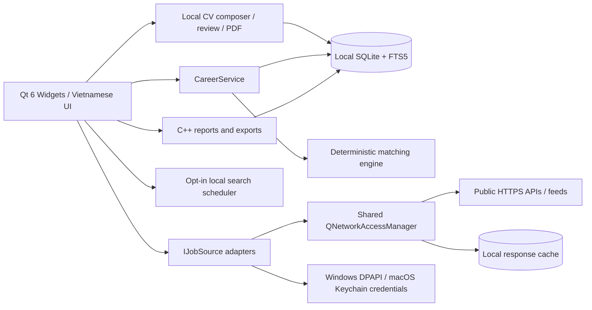
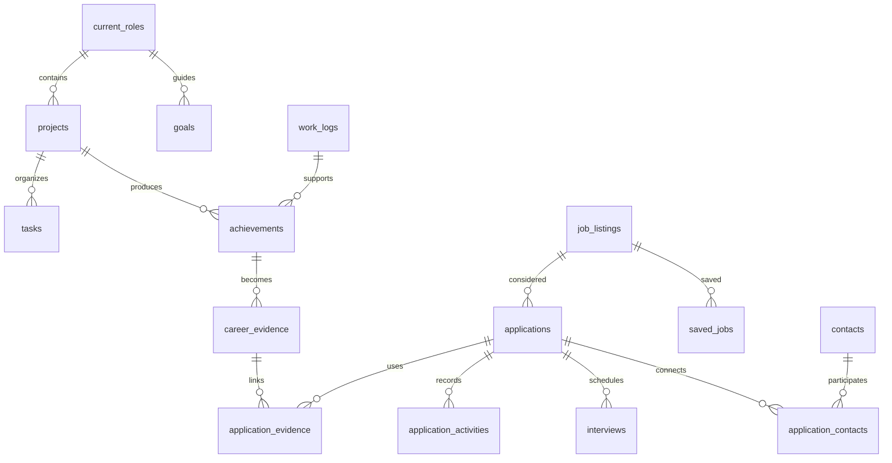

# PathWeave

**Turn today’s work into tomorrow’s opportunity.**

PathWeave is a native Windows and macOS career workspace built with C++20 and shared Qt 6
Widgets. It connects current roles, projects, tasks and entered achievements to
reusable career evidence, job discovery, applications, interviews and follow-ups.
Your SQLite database stays on your computer. No account or remote backend is needed.





Build and installation evidence: [verification record](docs/VERIFICATION.md).

## CV tailored to a job

Open a job and choose **Tạo CV theo JD**, or use **Ứng tuyển → Tạo CV theo JD**.
Paste a JD or select a saved job, edit profile contact/education/certificates, and
choose the experience/evidence you permit sharing. The local C++ composer ranks
existing skills, projects and evidence; it never turns requirements into candidate
facts. Private notes and demo records are excluded. Role/project descriptions use
the dedicated **Mô tả được phép đưa vào CV** field.

Edit the plain-text draft, optionally select your own PNG/JPEG photo, review it,
then export PDF/HTML/TXT or attach a PDF version to an application. TXT contains
text only; HTML/PDF can include the photo. Each saved version keeps its JD snapshot
and provenance. Export and attachment require the review checkbox. No application
is submitted. This is deterministic tailoring, not an LLM or a guarantee of the
best CV or hiring success. See [CV guide](docs/CV_AND_DISCOVERY.md).

## Features

- Vietnamese native desktop interface with 14 navigation pages, light/dark themes,
  keyboard navigation and Ctrl+K local full-text search.
- Skippable profile survey covering all eight sections, completion percentage and
  editable preferences. Employment type and workplace mode are independent.
- Current roles, projects, tasks, goals, work logs, feedback, blockers, achievements,
  skills, contacts, managed document copies and reminders.
- Task lists, status boards and deadline calendars; date, project, role, application,
  priority and status filters. Drag cards between status columns or double-click to edit.
- Convert entered achievements to editable career evidence; link evidence to
  applications without inventing numbers or accomplishments.
- Separate discovered jobs, saved jobs and applications. Partial unique indexes
  guard canonical URLs, source IDs and scoped company/title identities. Distinct
  requisition URLs are kept separate, even when company/title match.
- Application activity history, interviews, follow-up dates and a unified calendar.
- Deterministic match scores with visible component scores, reasons, missing
  preferences, neutral unknown salary, title synonyms and configurable weights.
- Monthly work, career evidence, application funnel and job match reports.
  Markdown, HTML and PDF report export; CSV export; JSON and password-encrypted
  backup/restore including managed documents and CV versions. Demo records are
  excluded from reports; monthly application cohorts use recorded status events.
- One-click marked demo dataset and demo removal. Demo vacancies are fictional.
- Explicit online opt-in, per-source switches, asynchronous sync, opt-in scheduled searches/tray mode, cancellation,
  TLS validation, timeouts, rate limits and response caching.

## Architecture



There is no Electron, React, QML frontend, browser engine, Node.js or Python runtime.
QTextBrowser renders local rich text, not a web application. C++ implements the UI,
data layer, networking, parsing, matching, imports, exports and reports.

See [architecture and data contracts](docs/ARCHITECTURE.md).

## Database model



The full schema has 30 domain tables plus migration, FTS5 and response-cache tables.
It includes timestamps, soft-delete markers, demo flags, foreign keys and indexes.
The typed schema registry also drives native field editors and enum validation.
Migrations run in a transaction and reject newer incompatible database versions.

Default Windows database:
`%LOCALAPPDATA%\PathWeave\PathWeave\pathweave.sqlite3`.
The exact location is shown in Settings. `--data-dir <directory>` selects an isolated
profile. Settings offers Windows EFS encryption for the data folder on supported
Windows/NTFS installations. EFS is opt-in and reports failure explicitly. Back up
your Windows EFS certificate and keep a password-encrypted portable backup before
reinstalling Windows. SQLite is not SQLCipher-encrypted; without EFS/device encryption
the database remains readable to processes with access to your account.

## Job sources and setup

| Adapter | Configuration | Scope and behavior |
| --- | --- | --- |
| Adzuna | app_id, app_key, country code, currency | Keyword/location/type/page API; requires your credentials |
| Remotive | No key | Public remote feed, attributed to Remotive; cached for six hours |
| Greenhouse | Public board token or supported board URL, company name | Published company job board; unknown type/mode remains unknown |
| Lever | Company site identifier, company name | Public postings; explicit commitment and workplace type |
| Generic JSON | HTTPS URL, root array path, field mappings | Dotted object paths; no authentication bypass |
| Generic RSS | HTTPS RSS/Atom URL, source/company | Standard feed metadata; unknown classifications remain unknown |
| User-provided URL | Public HTTPS job URL | JobPosting JSON-LD; unsupported pages require manual save |

Open **Nguồn tuyển dụng → Cấu hình**. For Adzuna enter the app ID and key in the
dedicated fields, then enable the source. They are protected with Windows DPAPI on Windows and macOS Keychain on macOS
for the current OS user, outside SQLite and JSON exports. Never paste keys
into a generic URL. Clear credentials from Settings when needed.

Enable **Cài đặt → Bật tìm việc trực tuyến**, read the first-use explanation,
and press **Tìm trực tuyến** in Discover Jobs. An empty keyword searches desired
titles (up to five; Adzuna up to three pages per title); public board/feed sources
are fetched once and ranked locally. Scheduled saved searches and daily/weekly
profile searches require a separate opt-in in Settings. The app must be running
or in its optional system tray mode. Shutdown does not run searches.
The interface never uploads a CV, work log, achievement or application note.
Only selected search terms, target titles when searching from the profile, location
and provider credentials are sent as needed. CV contents and work records stay local.

Source references: [Adzuna API](https://developer.adzuna.com/),
[Remotive public API](https://github.com/remotive-com/remote-jobs-api),
[Greenhouse Job Board API](https://docs.greenhouse.io/job-board.html),
[Lever postings API](https://github.com/lever/postings-api).

Some sources require API credentials. Coverage varies by country. Not every website
provides a public API. LinkedIn, Indeed and Glassdoor are **not stealth-scraped**.
Use **Mở tin gốc** and **Lưu việc thủ công** for unsupported sources; paste the URL,
job title, company and description yourself. Users must verify every listing on
its original source. Remote is only set when explicitly supplied by a source.
A match score assists preference comparison; it does not predict hiring success.

## Privacy and ethical access

Local features work offline. No login, telemetry, AI service or automatic document
upload is present. The network service performs public HTTPS GETs only, rejects
credential-bearing URLs, disables cookies and permits up to five same-origin HTTPS redirects. Cross-origin
redirects remain blocked; arbitrary-feed redirects must also pass robots rules. It applies a
15-second absolute deadline, an 8 MiB response limit and persistent rate intervals.
Unknown certificates, authentication requirements and anti-bot pages are errors.

Arbitrary feeds/pages first check robots.txt. Matching user-agent groups, longest path rules, Allow ties, wildcards and encoded
paths are evaluated; robots is rechecked on permitted redirected paths. It never
attempts to bypass CAPTCHA, robots restrictions, login, paywalls or anti-bot systems.
Successful payloads are cached locally; clear the response cache in Settings.
Remotive source attribution and original links are shown on each listing.

Full JSON backups retain soft-deleted rows so live child references can be restored.
JSON export contains private career records, CV snapshots/photos and managed
document contents, but no credential files. On Windows, the default `.pwbackup`
uses AES-256-GCM with PBKDF2-HMAC-SHA256 (600,000 iterations), implemented with
Windows CNG and a user-held password. macOS 1.1 currently exposes the explicitly
labeled unencrypted `.json` export path. Plain JSON is explicitly labeled unencrypted. Import replaces the database
transactionally, validates references and attachment hashes, clears cached responses and forces online search off. Uninstall
preserves career data; use Delete all data first if you want records removed.

## Local development and build commands

For Windows:

Requirements: Windows 10/11 x64; Visual Studio 2022 or later with Desktop development with C++.
CMake 3.24+, Ninja, shared Qt 6.5+ MSVC x64 (verified kit: Qt 6.8.3), and NSIS 3.
Qt modules: Core, Gui, Widgets, Network, SQL, PrintSupport, and Test.
The SQLite plugin must include FTS5. Qt Test is a build/test dependency, not shipped as runtime.

```powershell
$env:QT_ROOT_DIR = 'C:\Qt\6.8.3\msvc2022_64'
$env:PATH = "$env:QT_ROOT_DIR\bin;C:\Program Files (x86)\NSIS;$env:PATH"
cmake --preset windows-msvc-debug
cmake --build --preset windows-msvc-debug
ctest --preset windows-msvc-debug
cmake --preset windows-msvc-release
cmake --build --preset windows-msvc-release
ctest --preset windows-msvc-release
cpack --config build/Release/CPackConfig.cmake -G NSIS
```

Or use the helper, which locates the Visual Studio developer environment:

```powershell
./scripts/build.ps1 -Configuration Debug
./scripts/build.ps1 -Configuration Release -Package
./scripts/verify-installer.ps1
```

For macOS (Intel or Apple Silicon):

```bash
./scripts/build-macos.sh debug
./scripts/build-macos.sh release --package
```

```bash
cmake --preset macos-debug
cmake --build --preset macos-debug
ctest --preset macos-debug
cmake --preset macos-release
cmake --build --preset macos-release
ctest --preset macos-release
cpack --config build/macos/Release/CPackConfig.cmake -G DragNDrop
```

On Windows, the workspace includes shared Qt under `.tools/Qt/6.8.3/msvc2022_64` when available.
The Windows helper uses it automatically when QT_ROOT_DIR is unset.
On macOS, set `QT_ROOT_DIR` to your local Qt prefix or use install-qt-action in CI.
Optional MinGW presets are supplied for an independently installed Qt MinGW kit; the primary delivered artifacts use MSVC.
Do not mix MinGW headers with MSVC runtime.
## Run and install

Windows installer path:

**`release/PathWeave-Setup-x64.exe`**

macOS installer path (CI generated):

**`release/PathWeave-Setup-macOS-<arch>.dmg`**

Windows: run the installer and open PathWeave from the Start menu.
Default install folder is `%LOCALAPPDATA%\PathWeave`.

macOS: open the `.dmg`, drag `PathWeave.app` to Applications, and run from Applications.

Development binaries:

```bash
./build/Release/PathWeave (Windows)
./build/macos/Release/PathWeave.app/Contents/MacOS/PathWeave (macOS)
./build/Release/PathWeave --data-dir ./artifacts/my-test-profile
```
The installer is unsigned. No code-signing certificate is configured, so OS security prompts may appear.
Packaging writes `release/SHA256SUMS.txt` with SHA-256 and exact file size.
## Tests and verification

Qt Test covers survey validation, profile completion, type/mode separation,
matching components, synonyms, exclusions, salary/remote behavior, duplicates,
migrations, CRUD, foreign keys, status transitions, entered-only evidence,
report calculations, JSON roundtrip/rollback, CSV escaping, FTS synchronization,
source parsers, configuration errors, offline gating, safe URLs, real asynchronous
fixture timeouts/cancellation/429/cache expiration, DPAPI/Keychain credential protection and exact demo counts.

The native UI workflow clicks survey and form Save buttons, creates work records,
converts evidence, loads the demo source, checks full-time/part-time/remote filters,
saves a job, records an application/follow-up/interview, opens all pages, and checks
persistence after reopening SQLite. Installer smoke checks run the installed app in
a separate process with development DLL directories removed from PATH, followed by
another process to verify persisted records. JSON, CSV, Markdown, HTML and PDF
artifacts are checked before uninstall. These are automated widget/service tests;
they are not a claim of comprehensive manual or clean-VM testing.

Results: `build/Debug/test-results.xml`, `build/Release/test-results.xml`,
`artifacts/installer-verification.json`, and `artifacts/installed-checks/`.
The Windows GitHub Actions workflow builds, tests, packages and verifies installation,
uploads artifacts, and publishes version-tag releases when its token has permission.

## Known limitations

- LinkedIn/VietnamWorks account linking is explicitly out of scope. No stealth scraping.
- CV selection/ranking is deterministic and local. It does not rewrite prose using
  AI, infer unentered achievements, verify certificates with issuers, or guarantee
  an optimal CV. Users review factual accuracy, spelling, length and suitability.
- Credentialed source validation still needs real credentials. Source availability,
  API quotas and geographic coverage are controlled by providers. A feed can contain
  incomplete salary/visa/skills metadata; users must check the original listing.
- Generic extraction supports JobPosting JSON-LD and ordinary feeds, not JavaScript,
  authenticated pages or challenges. Redirects to a different origin remain blocked.
- Remotive's six-hour request interval means successive distinct queries can be
  rate-limited. Adzuna requests are queued, honor source intervals and can be cancelled.
- Synonyms are a curated Vietnamese/English dictionary. Salary text is not reliably
  parsed and different currencies remain neutral; no automatic FX/gross-net conversion.
  Explicit feedback changes at most four points and can be disabled in Settings.
- Schedules and Windows reminders need the app running; no server or Windows service
  runs while the PC is off. Notifications depend on Windows notification settings.
- Calendar exports ICS and converts interview timestamps to UTC. Recurrence editing,
  Google/Outlook account synchronization and ICS import are not implemented.
- EFS depends on Windows edition/filesystem/policy and protects files at rest, not
  against a compromised logged-in account. SQLCipher and a separate app unlock
  password are not implemented. Old plaintext exports and external backups cannot
  be remotely erased; permanent deletion is not a forensic SSD erase guarantee.
- Managed attachments are limited to 20 MiB each; backups to 512 MiB. Legacy path-only
  documents need re-importing once. Keep backup passwords/EFS recovery material safe.
- The installer remains unsigned unless a real signing identity is configured.
  Broad clean-VM, assistive-technology certification and a signed automatic updater
  remain outside the verified release. See the verification record for actual runs.

## Roadmap

Expand source integration tests when credentials are available; add recurrence and
calendar import, broader skill taxonomy and role-specific CV templates; implement
signed update delivery after selecting a distribution endpoint and signing identity.

## Troubleshooting

- **Qt6 DLL or Windows platform plugin missing:** use the installer; for development
  put the matching Qt kit bin on PATH. Do not mix debug/release or MinGW/MSVC DLLs.
- **FTS5 unavailable:** use a Qt QSQLITE plugin built with FTS5. Startup fails explicitly
  rather than silently degrading search.
- **No jobs:** inspect per-source configuration, online opt-in, errors and filters.
  Unknown workplace mode does not match the Remote view. Demo data works offline.
- **Rate limited:** wait for the source interval; Remotive is limited to one fetch
  per six hours. Cached successful data may be available meanwhile.
- **Invalid JSON restore:** the version-1 JSON backup format remains accepted, including v2 database fields. Invalid
  foreign keys/columns cause rollback; the existing database remains intact.
- **NSIS unavailable:** install NSIS and put makensis.exe on PATH before CPack.
- **Antivirus/SmartScreen:** the release is unsigned; compare the documented SHA-256.

## License

PathWeave code: [MIT](LICENSE). Qt is dynamically linked, with LGPLv3/commercial
licensing requirements described in [third-party notices](docs/THIRD_PARTY_NOTICES.md).
The installer includes GPL/LGPL license texts. Distributors must preserve Qt notices,
provide access to the matching Qt source and permit replacement/debugging of modified
shared Qt libraries. See [Qt licensing](https://doc.qt.io/qt-6/licensing.html).

